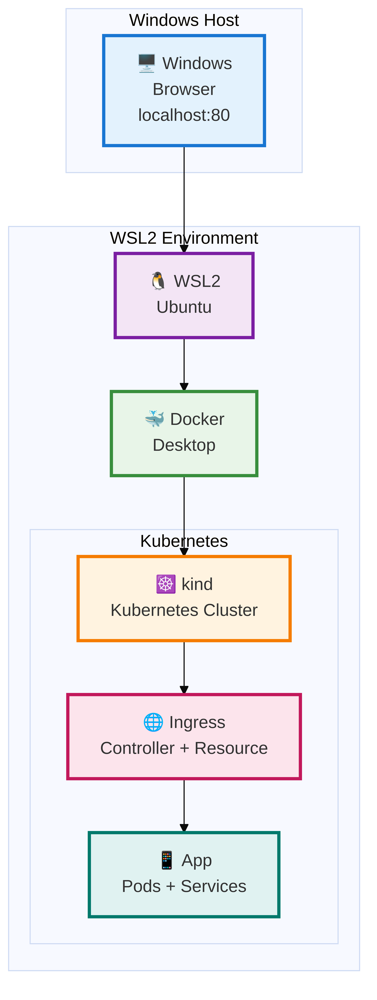
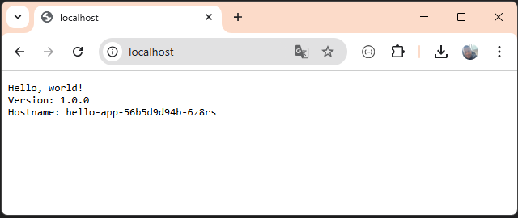

# Kind com multiplos nodes e Ingress no WSL 
🚀 Kind (Kubernetes In Docker) Com 3 nodes e Ingress.

✅ Contém um App Hello (simples) com Deployment, Service, HPA e Ingress.

⚠️ Maiores detalhes dos componentes, recursos, consultar documentação (Referências).

💡 O intuito aqui é criar uma infra basica pronta para subir app e expor, tudo local.

❌ Não usar em ambiente Produtivo.

# Fluxograma 🖼️


## Pré Requisitos
WSL - https://learn.microsoft.com/pt-br/windows/wsl/install

Docker no WSL - https://docs.docker.com/engine/install/ubuntu/#install-using-the-repository

Kubectl - Instalar :

```bash
$ curl -LO "https://dl.k8s.io/release/$(curl -L -s https://dl.k8s.io/release/stable.txt)/bin/linux/amd64/kubectl"
$ sudo install -o root -g root -m 0755 kubectl /usr/local/bin/kubectl && rm kubectl
#Validar, comando consulta versão 
$ kubectl version --client
Client Version: v1.33.4
Kustomize Version: v5.6.0
```
Não estar utilizando porta 80 e 443.

## Infraestrutura - Kind e Ingress 🏗️ 🧱

```bash
[ $(uname -m) = x86_64 ] && curl -Lo ./kind https://kind.sigs.k8s.io/dl/v0.29.0/kind-linux-amd64
chmod +x ./kind
sudo mv ./kind /usr/local/bin/kind
```
Vamos conferir a instalação verificando a versão do kind.

```bash
$ kind --version
kind version 0.29.0
```

## Criar cluster 

Criar cluster com 1 control plane e 3 nodes.

```bash
$ kind create cluster --config kind-config.yaml
```
```bash
Creating cluster "kind" ...
 ✓ Ensuring node image (kindest/node:v1.33.1) 🖼
 ✓ Preparing nodes 📦 📦 📦 📦
 ✓ Writing configuration 📜
 ✓ Starting control-plane 🕹️
 ✓ Installing CNI 🔌
 ✓ Installing StorageClass 💾
 ✓ Joining worker nodes 🚜
Set kubectl context to "kind-kind"
You can now use your cluster with:

kubectl cluster-info --context kind-kind

Have a nice day! 👋
```
Vamos conferir o cluster

```bash
$ kubectl cluster-info --context kind-kind
Kubernetes control plane is running at https://127.0.0.1:38611
CoreDNS is running at https://127.0.0.1:38611/api/v1/namespaces/kube-system/services/kube-dns:dns/proxy

To further debug and diagnose cluster problems, use 'kubectl cluster-info dump'.
```
Control Plane e Nodes
```bash
$ kubectl get nodes
NAME                 STATUS   ROLES           AGE    VERSION
kind-control-plane   Ready    control-plane   100m   v1.33.1
kind-worker          Ready    <none>          100m   v1.33.1
kind-worker2         Ready    <none>          100m   v1.33.1
kind-worker3         Ready    <none>          100m   v1.33.1
```

## Instalar ingress

Vamos instalar o Ingress - Nginx

⚠️ Importante, este ingress-nginx.yaml foi ajustando para o Deployment ser criado dentro do kind-control-plane, onde as portas 80 / 443 estão expostas.

```bash
$ kubectl apply -f ingress-controller/ingress-nginx.yaml
```
```bash
namespace/ingress-nginx created
serviceaccount/ingress-nginx created
serviceaccount/ingress-nginx-admission created
role.rbac.authorization.k8s.io/ingress-nginx created
role.rbac.authorization.k8s.io/ingress-nginx-admission created
clusterrole.rbac.authorization.k8s.io/ingress-nginx created
clusterrole.rbac.authorization.k8s.io/ingress-nginx-admission created
rolebinding.rbac.authorization.k8s.io/ingress-nginx created
rolebinding.rbac.authorization.k8s.io/ingress-nginx-admission created
clusterrolebinding.rbac.authorization.k8s.io/ingress-nginx created
clusterrolebinding.rbac.authorization.k8s.io/ingress-nginx-admission created
configmap/ingress-nginx-controller created
service/ingress-nginx-controller created
service/ingress-nginx-controller-admission created
deployment.apps/ingress-nginx-controller created
job.batch/ingress-nginx-admission-create created
job.batch/ingress-nginx-admission-patch created
ingressclass.networking.k8s.io/nginx created
validatingwebhookconfiguration.admissionregistration.k8s.io/ingress-nginx-admission created
```
Aguardar, e para acompanhar conferir se pod esta com status `RUNNING` no namespace `ingress-nginx`.
Importante, validar que esta executando no node control-plane / kind-control-plane

```bash
$ $ kubectl get pods -n ingress-nginx -o wide
NAME                                        READY   STATUS    RESTARTS   AGE   IP           NODE                 NOMINATED NODE   READINESS GATES
ingress-nginx-controller-6dc7cbc587-b5rgr   1/1     Running   0          11h   10.244.0.5   kind-control-plane   <none>           <none>
```


# 🚀 Subindo um App Hello 🚀 

Vamos subir um App Hello para testar a infra (os 3 nodes) e o ingress.
Utilizaremos HPA com mínimo 3 replicas/pods, assim visualizar a distribuição dos pods nos nodes 🔥. 

## Criar no namespace

Criar um namespace dedicado para aplicação, organizar e facilitar consultas e visualizações.

```bash
$ kubectl apply -f app/namespace.yaml
namespace/app-frontend created
```
## Subindo app Hello

Aplicando Yamls da aplicação.

❗Importante, antes de aplicar, faça leitura dos Yamls, para conhecimento.

- app/deployment.yaml
- app/service.yaml
- app/hpa.yaml
- app/ingress.yaml

```bash
$ kubectl apply -f app/deployment.yaml -f app/service.yaml -f app/hpa.yaml -f app/ingress.yaml -n app-frontend

deployment.apps/hello-app created
service/hello-svc created
horizontalpodautoscaler.autoscaling/hello-hpa created
ingress.networking.k8s.io/hello-ingress created
```

Consulta os pods, vai aparecer os 3 e cada um em um `NODE` 🔥

```bash
$ kubectl get pods -n app-frontend -o wide

NAME                         READY   STATUS    RESTARTS   AGE     IP           NODE           NOMINATED NODE   READINESS GATES
hello-app-56b5d9d94b-6vl4f   1/1     Running   0          2m35s   10.244.3.4   kind-worker3   <none>           <none>
hello-app-56b5d9d94b-ljpfg   1/1     Running   0          2m35s   10.244.2.5   kind-worker    <none>           <none>
hello-app-56b5d9d94b-p4hnl   1/1     Running   0          2m35s   10.244.1.3   kind-worker2   <none>           <none>
```

## Resultado ✅

Via browser chamar http://localhost




# Referencias e Documentações 📚

Instalar WSL -> https://learn.microsoft.com/pt-br/windows/wsl/install

Instalar Docker no WSL -> https://docs.docker.com/engine/install/ubuntu/#install-using-the-repository

Permissões executar Docker -> https://docs.docker.com/engine/install/linux-postinstall/


# Sugestões 💡 ✨

Pode utilizar esta base de infraestrutura para instalar, testar, componentes, tais como:
- Prometheus
- Grafana
- Istio

Entre outros.

